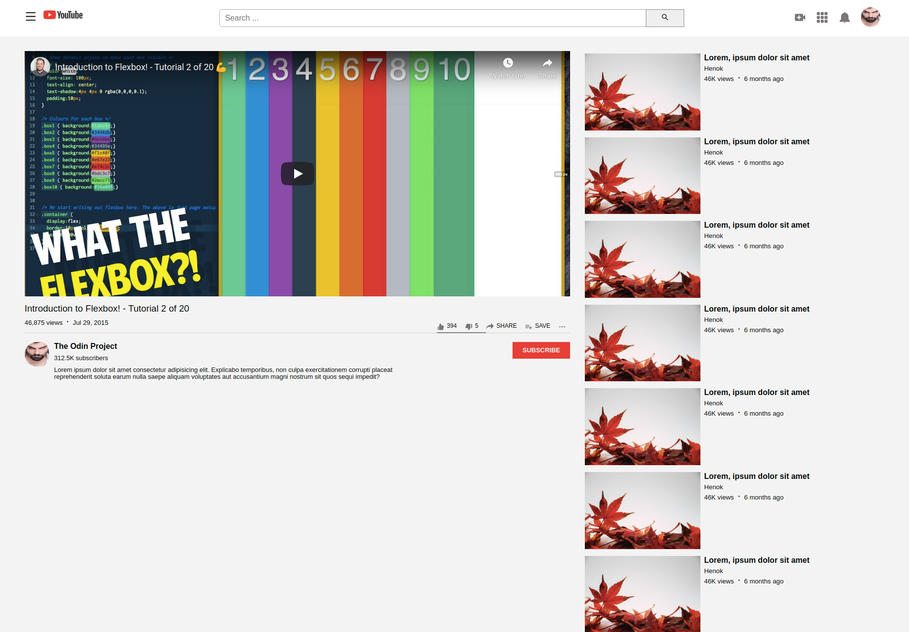

# Youtube Video Player Page

> This project is about cloning the youtube video player page.

The features of this project are listed as below:
1. Have a video player where user can play video.
2. Search input for searching a video.
3. Provides a list of recommended videos.
4. Display a avatar of user who uploaded the video.
5. Has subscribe, like, dislike, share, save  button
6. Has description of video content 
7. Provides profile image of logged-in user 

## Built With

- HTML5
- CSS3

## Live Demo

[Live Demo Link](https://henatan99.github.io/youtube-video-player-page/)

## Getting Started

**Just clone this repo and open index.html file in your browser then you are good to go.**

**To get a local copy up and running follow these simple example steps.**

### clone the repo.

## Authors

👤 **Henok Mossissa**

- GitHub: [@henatan99](https://github.com/henatan99)
- Twitter: [@henatan99](https://twitter.com/henatan99)
- LinkedIn: [Henok Mossissa](https://www.linkedin.com/in/henok-mekonnen-2a251613/)

👤 **Dipesh Bajgain**

- GitHub: [@dipbazz](https://github.com/dipbazz)
- Twitter: [@dipbazz](https://twitter.com/dipbazz)
- LinkedIn: [Dipesh Bajgain](https://www.linkedin.com/in/dipbazz/)

## 🤝 Contributing

Contributions, issues, and feature requests are welcome!

## Show your support

Give a ⭐️ if you like this project!

## Acknowledgments

- images have been used from [pixabay](https://pixabay.com/)
- icons used from [iconify](https://iconify.design/)
- youtube logo used from [pngegg](https://www.pngegg.com/en/png-zvlxf)

## 📝 License

This project is [MIT](https://github.com/henatan99/youtube-video-player-page/blob/youtube-homepage/LICENSE) licensed.
